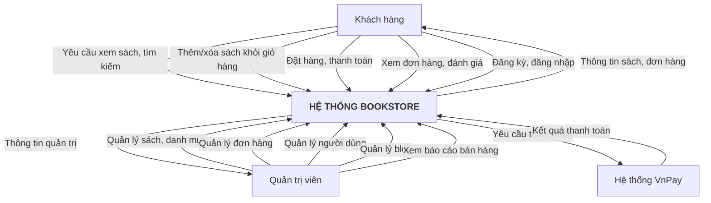
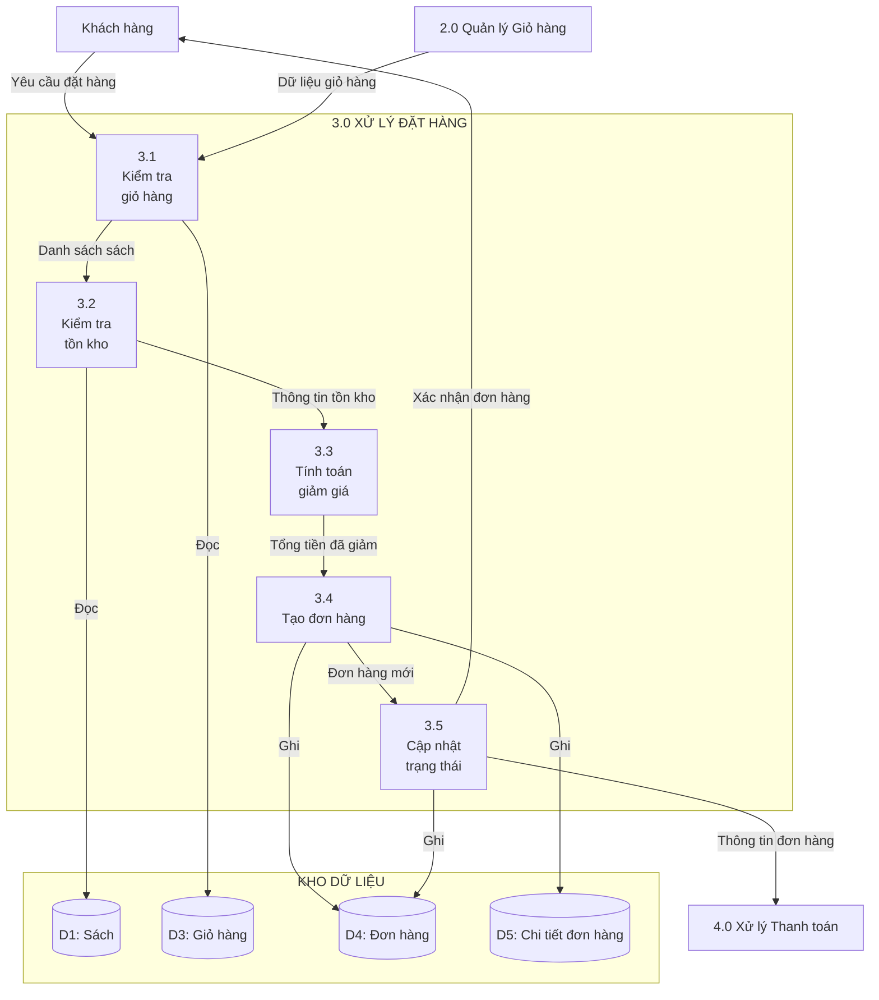
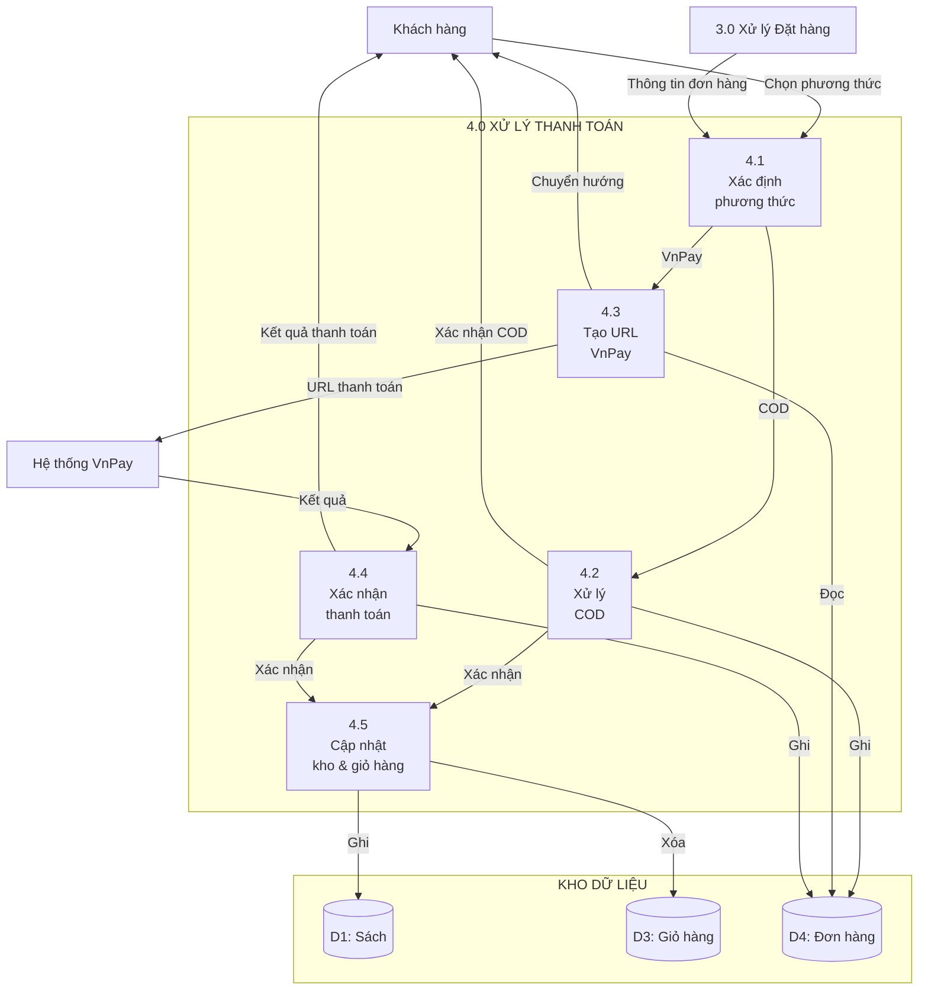

# Sơ Đồ DFD - Hệ Thống BookStore

## 1. Sơ Đồ Ngữ Cảnh (Context Diagram - Mức 0)

Sơ đồ ngữ cảnh mô tả hệ thống BookStore và các tác nhân bên ngoài tương tác với hệ thống.



**Mô tả:**
- **Khách hàng**: Tương tác với hệ thống để xem sách, mua hàng, quản lý đơn hàng
- **Quản trị viên**: Quản lý toàn bộ hệ thống (sách, đơn hàng, người dùng, blog)
- **Hệ thống VnPay**: Xử lý thanh toán trực tuyến

---

## 2. Sơ Đồ Mức Đỉnh (Top Level DFD - Mức 1)

Sơ đồ mức đỉnh phân rã hệ thống thành các chức năng chính.

```mermaid
graph TB
    Customer[Khách hàng]
    Admin[Quản trị viên]
    VnPay[Hệ thống VnPay]
    
    subgraph System["HỆ THỐNG BOOKSTORE"]
        P1[1.0<br/>Quản lý<br/>Sách & Danh mục]
        P2[2.0<br/>Quản lý<br/>Giỏ hàng]
        P3[3.0<br/>Xử lý<br/>Đặt hàng]
        P4[4.0<br/>Xử lý<br/>Thanh toán]
        P5[5.0<br/>Quản lý<br/>Đơn hàng]
        P6[6.0<br/>Quản lý<br/>Đánh giá]
        P7[7.0<br/>Quản lý<br/>Blog]
        P8[8.0<br/>Quản trị<br/>Hệ thống]
        P9[9.0<br/>Xác thực<br/>Người dùng]
    end
    
    subgraph DataStores["KHO DỮ LIỆU"]
        D1[(D1: Sách)]
        D2[(D2: Danh mục)]
        D3[(D3: Giỏ hàng)]
        D4[(D4: Đơn hàng)]
        D5[(D5: Chi tiết đơn hàng)]
        D6[(D6: Đánh giá)]
        D7[(D7: Blog)]
        D8[(D8: Người dùng)]
    end
    
    Customer -->|Yêu cầu xem sách| P1
    Customer -->|Thêm/xóa giỏ hàng| P2
    Customer -->|Tạo đơn hàng| P3
    Customer -->|Thanh toán| P4
    Customer -->|Xem đơn hàng| P5
    Customer -->|Đánh giá sách| P6
    Customer -->|Xem blog| P7
    Customer -->|Đăng ký/Đăng nhập| P9
    
    Admin -->|Quản lý sách| P1
    Admin -->|Quản lý đơn hàng| P5
    Admin -->|Quản lý blog| P7
    Admin -->|Quản trị hệ thống| P8
    Admin -->|Xác thực| P9
    
    P1 -->|Đọc/Ghi| D1
    P1 -->|Đọc| D2
    P2 -->|Đọc/Ghi| D3
    P2 -->|Đọc| D1
    P3 -->|Ghi| D4
    P3 -->|Ghi| D5
    P3 -->|Đọc| D1
    P3 -->|Đọc| D3
    P4 -->|Đọc/Ghi| D4
    P4 -->|Yêu cầu thanh toán| VnPay
    VnPay -->|Kết quả| P4
    P5 -->|Đọc/Ghi| D4
    P5 -->|Đọc| D5
    P6 -->|Ghi| D6
    P6 -->|Đọc| D1
    P7 -->|Đọc/Ghi| D7
    P8 -->|Đọc/Ghi| D8
    P8 -->|Đọc/Ghi| D1
    P8 -->|Đọc/Ghi| D2
    P8 -->|Đọc/Ghi| D4
    P9 -->|Đọc/Ghi| D8
    
    P1 -->|Thông tin sách| Customer
    P2 -->|Thông tin giỏ hàng| Customer
    P3 -->|Xác nhận đơn hàng| Customer
    P4 -->|Kết quả thanh toán| Customer
    P5 -->|Thông tin đơn hàng| Customer
    P6 -->|Xác nhận đánh giá| Customer
    P7 -->|Nội dung blog| Customer
    P8 -->|Thông tin quản trị| Admin
```



**Các luồng dữ liệu chính:**
- **D1 (Sách)**: Lưu thông tin sách (tên, tác giả, giá, tồn kho, ảnh bìa...)
- **D2 (Danh mục)**: Lưu danh mục sách
- **D3 (Giỏ hàng)**: Lưu tạm thời các sách trong giỏ (Session)
- **D4 (Đơn hàng)**: Lưu thông tin đơn hàng (người mua, địa chỉ, tổng tiền, trạng thái)
- **D5 (Chi tiết đơn hàng)**: Lưu chi tiết từng sách trong đơn hàng
- **D6 (Đánh giá)**: Lưu đánh giá và điểm số của khách hàng
- **D7 (Blog)**: Lưu bài viết blog
- **D8 (Người dùng)**: Lưu thông tin tài khoản người dùng

---

## 3. Sơ Đồ Mức Dưới Đỉnh (Level 1 DFD)

### 3.1. Phân rã chức năng 3.0 - Xử lý Đặt hàng



### 3.2. Phân rã chức năng 4.0 - Xử lý Thanh toán



### 3.3. Phân rã chức năng 1.0 - Quản lý Sách & Danh mục

```mermaid
graph TB
    Customer[Khách hàng]
    Admin[Quản trị viên]
    
    subgraph P1["1.0 QUẢN LÝ SÁCH & DANH MỤC"]
        P1_1[1.1<br/>Hiển thị<br/>danh sách sách]
        P1_2[1.2<br/>Tìm kiếm<br/>& lọc]
        P1_3[1.3<br/>Xem chi tiết<br/>sách]
        P1_4[1.4<br/>Quản lý sách<br/>(Admin)]
        P1_5[1.5<br/>Quản lý<br/>danh mục]
    end
    
    subgraph DataStores["KHO DỮ LIỆU"]
        D1[(D1: Sách)]
        D2[(D2: Danh mục)]
    end
    
    Customer -->|Yêu cầu xem sách| P1_1
    Customer -->|Tìm kiếm| P1_2
    Customer -->|Xem chi tiết| P1_3
    Admin -->|Thêm/sửa/xóa sách| P1_4
    Admin -->|Quản lý danh mục| P1_5
    
    P1_1 -->|Đọc| D1
    P1_1 -->|Đọc| D2
    P1_2 -->|Đọc| D1
    P1_2 -->|Đọc| D2
    P1_3 -->|Đọc| D1
    P1_4 -->|Đọc/Ghi| D1
    P1_4 -->|Đọc| D2
    P1_5 -->|Đọc/Ghi| D2
    
    P1_1 -->|Danh sách sách| Customer
    P1_2 -->|Kết quả tìm kiếm| Customer
    P1_3 -->|Chi tiết sách| Customer
    P1_4 -->|Xác nhận| Admin
    P1_5 -->|Xác nhận| Admin
```

### 3.4. Phân rã chức năng 5.0 - Quản lý Đơn hàng

```mermaid
graph TB
    Customer[Khách hàng]
    Admin[Quản trị viên]
    
    subgraph P5["5.0 QUẢN LÝ ĐƠN HÀNG"]
        P5_1[5.1<br/>Xem danh sách<br/>đơn hàng]
        P5_2[5.2<br/>Xem chi tiết<br/>đơn hàng]
        P5_3[5.3<br/>Hủy đơn hàng<br/>(Customer)]
        P5_4[5.4<br/>Cập nhật trạng thái<br/>(Admin)]
        P5_5[5.5<br/>Xem báo cáo<br/>bán hàng]
    end
    
    subgraph DataStores["KHO DỮ LIỆU"]
        D4[(D4: Đơn hàng)]
        D5[(D5: Chi tiết đơn hàng)]
        D1[(D1: Sách)]
    end
    
    Customer -->|Yêu cầu xem đơn| P5_1
    Customer -->|Xem chi tiết| P5_2
    Customer -->|Hủy đơn| P5_3
    Admin -->|Cập nhật trạng thái| P5_4
    Admin -->|Xem báo cáo| P5_5
    
    P5_1 -->|Đọc| D4
    P5_2 -->|Đọc| D4
    P5_2 -->|Đọc| D5
    P5_2 -->|Đọc| D1
    P5_3 -->|Ghi| D4
    P5_4 -->|Ghi| D4
    P5_5 -->|Đọc| D4
    P5_5 -->|Đọc| D5
    
    P5_1 -->|Danh sách đơn| Customer
    P5_2 -->|Chi tiết đơn| Customer
    P5_3 -->|Xác nhận hủy| Customer
    P5_4 -->|Xác nhận| Admin
    P5_5 -->|Báo cáo| Admin
```

---

## 4. Tóm tắt các Chức năng

### Chức năng Khách hàng:
1. **Xem sách**: Duyệt danh sách, tìm kiếm, xem chi tiết
2. **Giỏ hàng**: Thêm, cập nhật, xóa sách khỏi giỏ hàng
3. **Đặt hàng**: Tạo đơn hàng với thông tin giao hàng
4. **Thanh toán**: Thanh toán COD hoặc qua VnPay
5. **Quản lý đơn**: Xem lịch sử, chi tiết, hủy đơn hàng
6. **Đánh giá**: Đánh giá và bình luận về sách
7. **Blog**: Xem các bài viết blog

### Chức năng Quản trị viên:
1. **Quản lý sách**: Thêm, sửa, xóa sách và danh mục
2. **Quản lý đơn hàng**: Xem, cập nhật trạng thái đơn hàng
3. **Quản lý người dùng**: Quản lý tài khoản và phân quyền
4. **Quản lý blog**: Tạo, sửa, xóa bài viết blog
5. **Báo cáo**: Xem báo cáo doanh thu và bán hàng

---

## 5. Ký hiệu sử dụng

- **Hình tròn**: Chức năng xử lý (Process)
- **Hình chữ nhật**: Tác nhân ngoài (External Entity)
- **Hình chữ nhật 2 cạnh**: Kho dữ liệu (Data Store)
- **Mũi tên**: Luồng dữ liệu (Data Flow)


